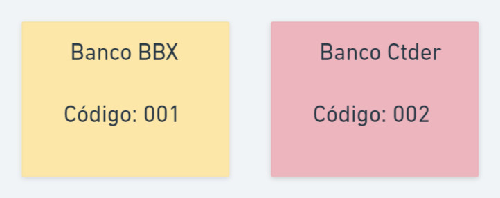
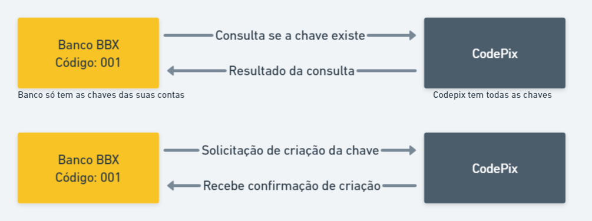
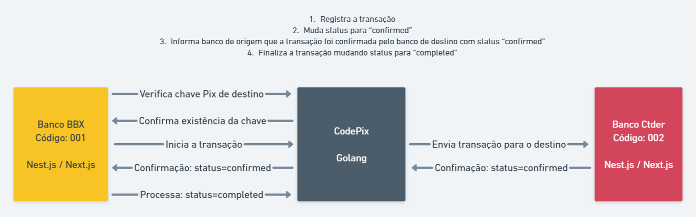

<h1>Codepix</h1>

Projeto desenvolvido na Imersão Full Stack & Full Cycle 1.0

## Sobre o Projeto

É uma solução para para simular trarnferências de valores entre bancos ficticios atráves de chaves (email, cpf)

Simulação de diversos bancos e contas bancárias que possuem chaves Pix atribuidas

Cada conta bancária poderá cadastrar suas chaves pix

Uma conta bancária poderá realizar tranferência para outra conta em outro banco utilizando a chave pix da conta de destino

Uma transação não pode ser perdida mesmo que o CodePix esteja fora do ar

Uma transação não pode ser perdida mesmo que o Banco de destino esteja fora do ar

### **Sobre os bancos**

O banco será um microsserviço com funções limitadas a cadastro de contas e chaves Pix, bem como transferência de valores

A mesma aplicação será utilizada para simular diversos bancos, mudando apenas cores, nome e código.

Nest.js no backend

Next.js no frontend

### **Sobre o CodePix**

O microsserviço CodePix será responsável po intermedias as tranferências bancárias

Receberá a transação de tranferência

Encaminhará a transação para o banco de destino (Status: "pending")

Recebe a confirmação do banco de destino (Status: "confirmed")

Envia confirmação para o banco de origem informado quando o banco de destino processou

Recebe a confirmação do banco de origem de que ele processou (Status: "completed")

Marca a transação como completa (Status: "completed")

#### **Cadastro e consulta de chave Pix**

### **Dinâmica do processo**

### **Principais Desafios**

Comunicação rápida e eficiente (REST não é o melhor)

Criação e consulta instantânea das chaves (Síncrona)

Garantia de que nenhuma transação seja perdida, mesmo que qualquer dos 3 sistemas estejam fora (Assíncrona)

**Tecnologias CodePix**:

- gRPC
- Apache Kafka
- Docker
- Golang
- Postgres

### Observações Gerais do Projeto

Será capaz de atual como um servidor gRPC

Consumir e publicar mensagens no Apache Kafka

Ambas operações devem ser realizadas de forma simultâneas ao executar o serviço

Trabalhar com um design focado em solucionar o problema do domínio (DDD - Domain Driven Design)

Deixar a coplexidade técnica para a "camada da aplicação", responsável pelo servidor gRPC e Kafka

Flexivel para implementação de outros formatos de comunicação, como API Rest, CLI clients, etc. SEM alterar nenhum outro compoenent da aplicação ou o modelo de domínio

---

## Arquitetura de Software

O software deve ser definidor por você e não pelo framework

As peças têm que se encaixar, mas eventualmente podem ser substituidas ou adicionadas
